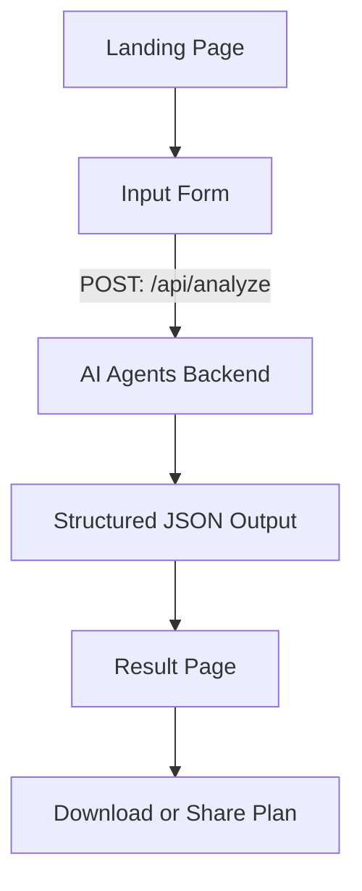

Perfect ✅ Rao Hamza — since you’ve already initialized your **Supabase + Next.js** project, we’ll now define the **complete implementation roadmap** (in `.md` format) that you can directly paste into **Cursor** to guide AI-powered development.

This plan assumes:

* You’re using **App Router (Next.js 14+)**
* Backend endpoint lives in **`/app/api/analyze/route.ts`**
* You’ll call the API from frontend pages (no `/lib/api.ts`).

---

# 🌾 AgriSense — AI-Powered Climate & Crop Planning App

> This document defines the complete flow, structure, and implementation plan for AgriSense, an AI-powered application that helps farmers plan their crops and strategies based on weather and climate insights.

---

## ⚙️ Tech Stack

* **Framework:** Next.js (App Router)
* **Language:** TypeScript
* **Database (Optional):** Supabase
* **Styling:** Tailwind CSS + Shadcn/UI
* **Animation:** Framer Motion
* **Icons:** Lucide React
* **API Calls:** Fetch (built-in)
* **Backend (FastAPI or internal route):** `/app/api/analyze/route.ts`

---

## 📁 Folder Structure

```
app/
 ├── layout.tsx
 ├── page.tsx                  → Landing page
 ├── analyze/
 │    ├── page.tsx             → User input form page
 │    ├── loading.tsx          → Loading animation page
 │    └── result/
 │         └── page.tsx        → Results dashboard page
 │
 ├── api/
 │    └── analyze/
 │         └── route.ts        → Main backend AI route
 │
components/
 ├── HeroSection.tsx
 ├── InputForm.tsx
 ├── LoadingAnimation.tsx
 ├── WeatherCard.tsx
 ├── CropCard.tsx
 ├── PlanTimeline.tsx
 └── Footer.tsx
```

---

## 🧠 Functional Flow



---

## 🧩 Core Pages Overview

### 1️⃣ Landing Page (`app/page.tsx`)

**Goal:** Introduce app & direct users to analysis form.

* Hero section with title, subtitle & CTA button.
* Button → navigates to `/analyze`
* Include animation using Framer Motion.

---

### 2️⃣ Input Page (`app/analyze/page.tsx`)

**Goal:** Collect area & farm details from user.

**Fields:**

* `Location` (text)
* `Soil Type` (dropdown)
* `Season` (dropdown)
* `Farm Size (optional)`

**Flow:**

1. On form submit → call `POST /api/analyze`
2. Redirect to `/analyze/loading` while waiting
3. Save API response in Supabase or localStorage for `/result` page

---

### 3️⃣ Loading Page (`app/analyze/loading.tsx`)

**Goal:** Show animated agent chain progress.
Text animation like:

* “Analyzing weather patterns…”
* “Finding best crop choices…”
* “Generating full agricultural plan…”

**After ~3–5s**, redirect to `/analyze/result`.

---

### 4️⃣ Result Page (`app/analyze/result/page.tsx`)

**Goal:** Display all agent results in structured format.

**Sections:**

1. **Weather Summary** → `<WeatherCard />`
2. **Crop Recommendations** → `<CropCard />`
3. **Complete Farming Plan** → `<PlanTimeline />`

**Bonus:**

* Button: “Download PDF Plan”
* Button: “Share with Farmer Community”

---

## 🧠 Backend Route — `/app/api/analyze/route.ts`

**Goal:** Process request → Run 3 agents → Return structured result.

### Example Flow:

```ts
import { NextResponse } from "next/server";

export async function POST(req: Request) {
  try {
    const body = await req.json();
    const { location, soilType, season } = body;

    // 1️⃣ Weather Agent
    const weatherResponse = await fetch(
      `https://api.openweathermap.org/data/3.0/onecall?...&appid=${process.env.OPENWEATHER_KEY}`
    );
    const weatherData = await weatherResponse.json();
    const weatherAgentOutput = {
      location,
      avg_temperature: weatherData.current.temp,
      humidity: weatherData.current.humidity,
      rainfall_mm: weatherData.daily[0].rain,
      climate_type: "Moderate",
      forecast_summary: "Light rain in coming days",
      risk_alerts: ["Possible flood risk in 7 days"],
      opportunities: ["Good conditions for wheat and maize"],
    };

    // 2️⃣ Crop Agent
    const cropAgentOutput = {
      location,
      suggested_crops: ["Wheat", "Maize"],
      unsuitable_crops: ["Cotton"],
      reasoning: "Moderate temperature and rainfall favor wheat growth",
      water_requirement_level: "Medium",
      expected_yield_potential: "High",
    };

    // 3️⃣ Planner Agent
    const plannerAgentOutput = {
      location,
      primary_crop: "Wheat",
      soil_preparation_steps: [
        "Plow soil 2 weeks before sowing",
        "Add organic compost",
      ],
      sowing_schedule: "Mid-November",
      irrigation_guidelines: [
        "Irrigate once a week",
        "Avoid overwatering after rainfall",
      ],
      fertilizer_recommendations: ["NPK fertilizer - 100kg/acre"],
      harvest_time: "Early April",
      storage_advice: ["Store in dry area with 14% moisture content"],
      risk_precautions: ["Watch for pest attacks post-rain"],
      overall_summary: "This plan optimizes yield and minimizes flood risk.",
    };

    const finalResponse = {
      weather: weatherAgentOutput,
      crop: cropAgentOutput,
      plan: plannerAgentOutput,
    };

    return NextResponse.json(finalResponse);
  } catch (error) {
    console.error("Error:", error);
    return NextResponse.json({ error: "Failed to analyze data" }, { status: 500 });
  }
}
```

---

## 🧾 TypeScript Interfaces (Optional, in `/types.ts`)

```ts
export interface WeatherSummary {
  location: string;
  avg_temperature: number;
  humidity: number;
  rainfall_mm: number;
  climate_type: string;
  forecast_summary: string;
  risk_alerts: string[];
  opportunities: string[];
}

export interface CropRecommendation {
  location: string;
  suggested_crops: string[];
  unsuitable_crops: string[];
  reasoning: string;
  water_requirement_level: string;
  expected_yield_potential: string;
}

export interface FarmingPlan {
  location: string;
  primary_crop: string;
  soil_preparation_steps: string[];
  sowing_schedule: string;
  irrigation_guidelines: string[];
  fertilizer_recommendations: string[];
  harvest_time: string;
  storage_advice: string[];
  risk_precautions: string[];
  overall_summary: string;
}

export interface AIResponse {
  weather: WeatherSummary;
  crop: CropRecommendation;
  plan: FarmingPlan;
}
```

---

## 🎨 UI Components Flow

| Component              | Role              | Description                    |
| ---------------------- | ----------------- | ------------------------------ |
| `HeroSection.tsx`      | Home page intro   | Main banner & CTA              |
| `InputForm.tsx`        | Collect user data | Location, season, soil type    |
| `LoadingAnimation.tsx` | Processing state  | Animated AI chain              |
| `WeatherCard.tsx`      | Display weather   | From Weather Agent             |
| `CropCard.tsx`         | Display crops     | From Crop Agent                |
| `PlanTimeline.tsx`     | Display plan      | From Planner Agent             |
| `Footer.tsx`           | Branding          | “Developed by Rao Hamza Tariq” |

---

## 🚀 Development Phases

| Day       | Task                            | Output             |
| --------- | ------------------------------- | ------------------ |
| **Day 1** | Setup, Tailwind, Shadcn, Layout | Base ready         |
| **Day 2** | Landing Page                    | HeroSection        |
| **Day 3** | Input Form                      | `/analyze` page    |
| **Day 4** | Loading + API Route (mock data) | `/analyze/loading` |
| **Day 5** | Result Page + Cards             | `/analyze/result`  |
| **Day 6** | Connect real OpenWeather API    | Working AI flow    |
| **Day 7** | UI polish + deploy to Vercel    | 🎯 MVP ready       |

---

## 🪶 Footer Text

```
Developed by Rao Hamza Tariq © 2025
```

